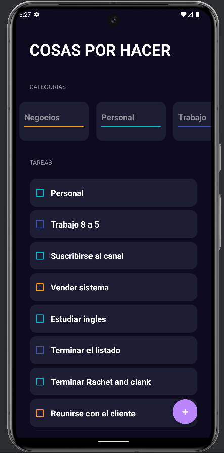
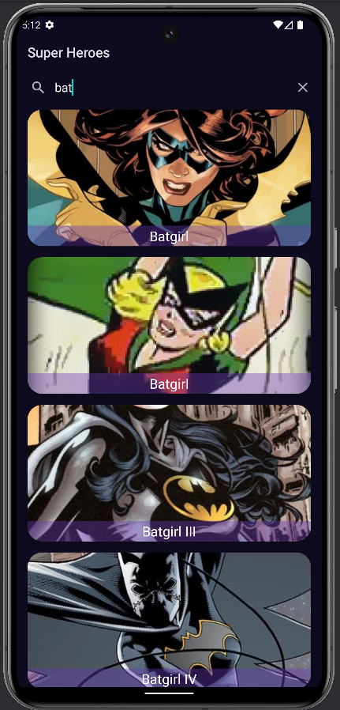
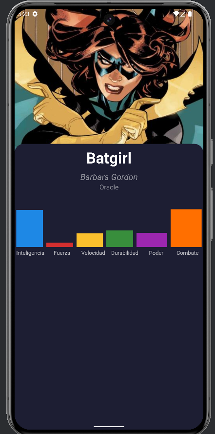
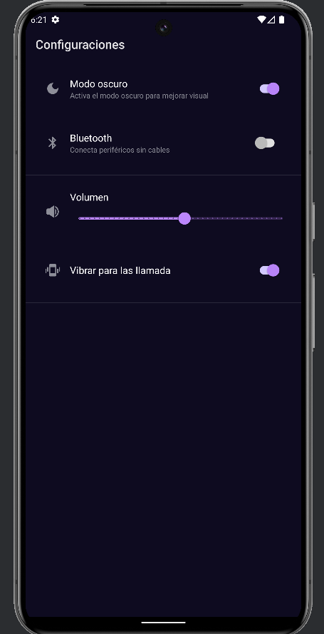

# Android con kotlin

- ## Fundamentos:
  - Valores, Variables y Tipos
  - Funciones
  - If Else When
  - Arrays
  - ListasonItemTaskSelected
- ## Ejercicios
- ## Apps:
    
   
    - ### SALUDAPP 
        
    
    - ### IMC 
        
    
    - ### TODO App 
        
    
    - ### Super Hero App 
         
      
    - ### Settings 
        
